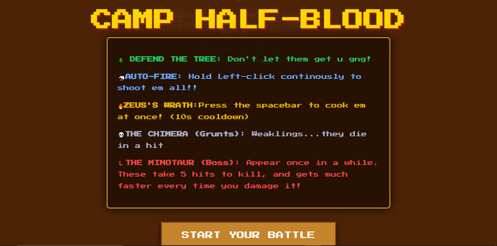
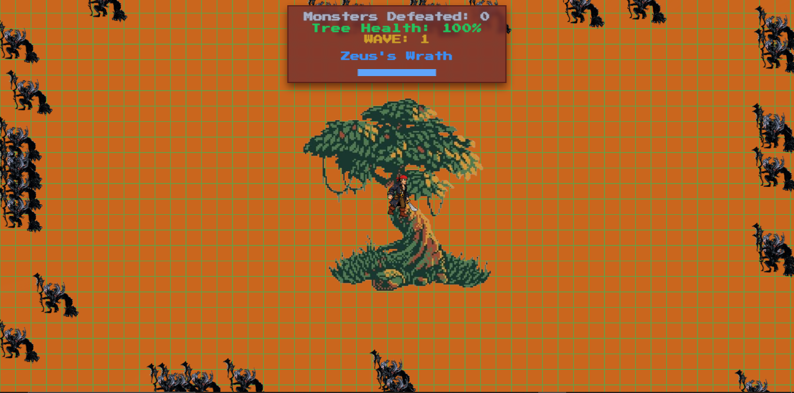
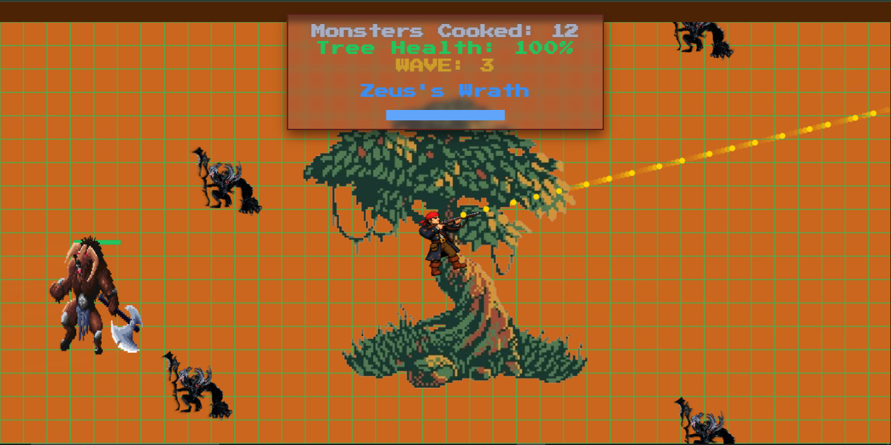
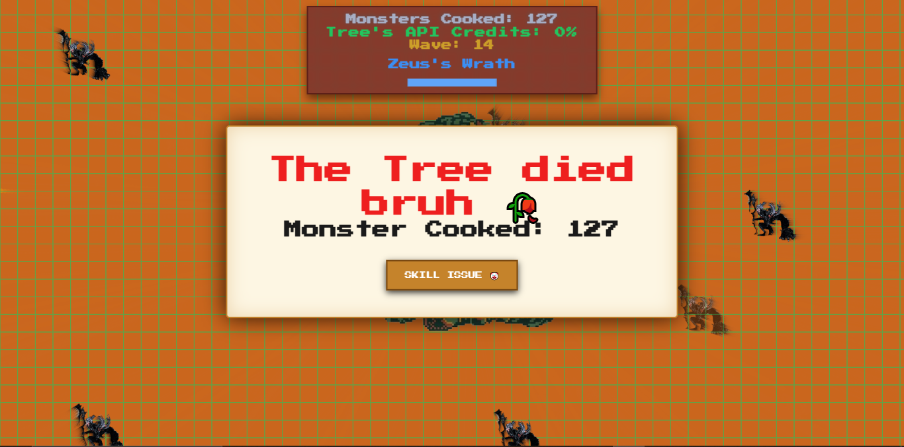
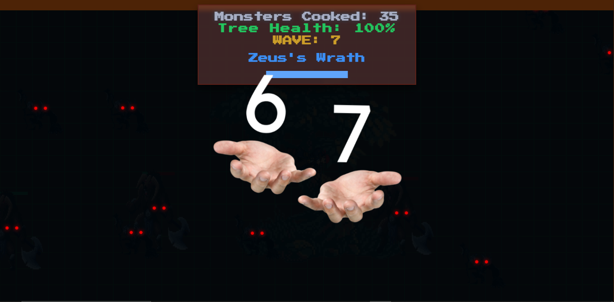

# Camp Half-Blood — Monster Manual

so the original idea was to build a greek monsters manual. like a digital index inspired by rick riordans percy jackson books, I spent basically all of junior grades reading those and they taught me way too much about how to kill mythological creatures, lol. 
So I wanted to make a slick UI where you could flip through entries for every monster in the series.

but as I got into it I realized the UI/UX direction I wanted was way more complex than I could pull off at my level. so I pivoted.

## what this is 

This is a top-down survival game set at camp half-blood. you play as a demigod standing in the middle of the screen protecting **Thalia's tree**- it is a pine tree on Thalia's Hill that guards the camp border. 
[for anyone who doesnt know: Thalia Grace (daughter of Zeus) was turned into a tree by her father to save her from dying, and its magic keeps monsters from crossing into the camp. so this is basically what it looks like when that magic starts slipping.]

## how it plays

monsters swarm in from all sides and you have to kill them before they reach the tree. every monster that gets to the tree does damage. and yea, tree dies, game over.

controls are simple:
- move your mouse to aim
- hold left click to auto-fire daggers (rapid fire, like 90ms intervals)
- press spacebar for **Zeus's Wrath** which gives a lightning nuke that clears the whole screen (10s cooldown) 

## the enemies

two types so far:

- CHIMERAS are basic grunts. they die in a hit. 
- MINOTAURS show up around wave 3. takes 5 hits to die and gets noticeably faster every time you land a shot.I've added a health bar above them so it's visible how close they are to being cooked.

## wave/levels

So every 5 kills you and you advance a wave and each wave makes monsters faster and reduces the spawn interval. Added a meme at level 6 or 7 and after that it gets hard to keep up especially bcz of the day and night theme as well.

## day and night cycle

every 15 seconds the game flips between day and night. at night the screen goes almost completely dark and monsters eyes glow red in the dark so you can track and shoot em. I spent a lil longer getting the canvas compositing right for this but it is cool now. I guess..

## the sounds

the pew sounds are web audio api square wave oscillators with frequency ramps. the explosion when you kill something is white noise through a lowpass filter. also have a couple mp3 files for game over and the meme.

## how I built it

vanilla js on html5 canvas, no frameworks. projectiles are objects in an array drawn and updated 60fps. collision is distance-based. enemy spawning runs on setInterval that gets faster each wave. The pixel art I took from google (took me a while to find the right monster, lol)

## langugages and other things

- vanilla javascript
- html5 canvas api
- web audio api
- pixel art (from ggl img)
- google fonts

## ai usage

ai helped me figure out the canvas compositing for the night vision and the biquad filter setup for the thunder sound.

## a note on the original idea

I still want to build that monster manual soon. maybe once I level up my frontend skills enough to do it justice. theres so many creatures in the percy jackson universe: hellhounds, dracanae, empousa, the labyrinth monsters and they def deserve a proper interactive index.

## license

MIT